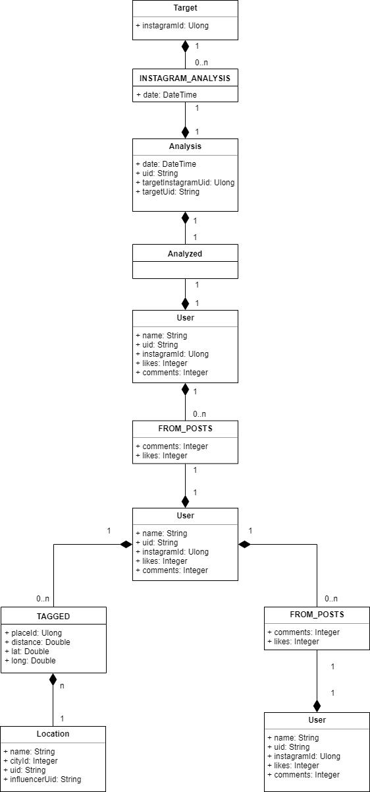

# Instagram parsing library
Приложение для поиска инфлюенсеров в социальной сети Instagram
## Функционал на текущий момент
Библиотека работает с базой данных Neo4j (**url**: http://188.68.210.25:7474/browser/, **log**: neo4j, **pass**: J9xMXjhMsZKn8$),
на данный момент функционал реализован частично в связи с неустраненными ошибками в работе класса ProxyClient. 
Приложение может анализировать пользователя, получая на вход никнейм(IInstagramParserManager.AnalyzeUser(username)). 
Методы для работы с уже сохраненными данными были удалены после глобального рефакторинга приложения и не были реализованы вновь (но их можно найти в коммитах данного проекта) из-за проблем описаных ниже
## Неразрешенные проблемы
Низкая скорость работы, вызванная, вероятно, неверным построением многопоточности в приложении (классы **InstagramParserManager** и **InstagramParser**).
Есть вероятность, что именно этим вызваны ошибки в работе класса ProxyClient, выдающим ошибки "Task was canceled" и "Хост принудительно прервал соединение", однако точно утверждать этого не могу.
Наиважнейшей задачей на данный момент является "ускорение" выполнения основной задачи библиотеки (анализ аудитории пользователя)
## Хранение в базе данных
За сохранение экземпляра Model в базу данных отвечает класс Neo4jDatabaseInstagramClient 
На данный момент вся информация сохраняется в neo4j в следующем виде:
  

## Связь со мной
Меня зовут Иван, в случае возникновения каких-либо вопросов по работе данной библиотеки, можно написать мне на электронную почту  
> vertvery@gmail.com

